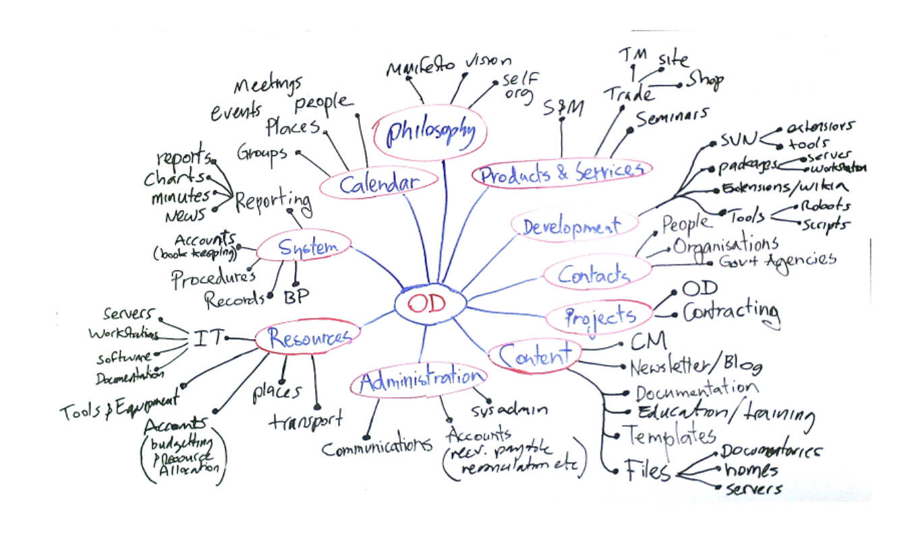

**Last Updated:** December 13th, 2024

# Ontologies
**Ontologies**, also known as **knowledge bases**, encode general-purpose real-world information.
- E.g., cat is a type of feline, and felines are a type of animal, while cars are a type of vehicle.
- As the name suggests, ontologies are represented in a tree structure.

## Summary

**Property graph/triple store models** are a good fit for encoding “knowledge.”
- Fits into the (subject, predicate, object)
- OR (node-edge->node) mode

Entity sets/schema doesn’t need to be fully declared in advance: can extend by adding additional properties of nodes or additional predicate/subject types 
