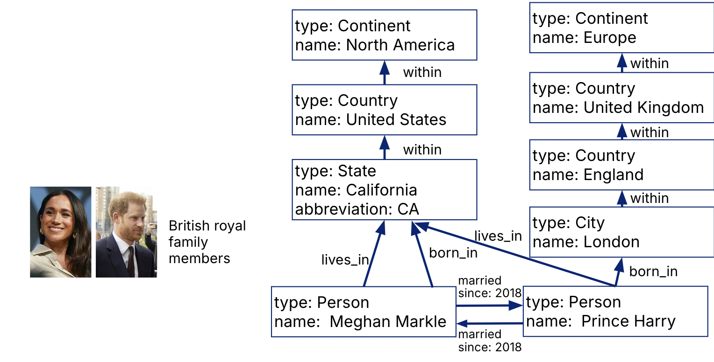
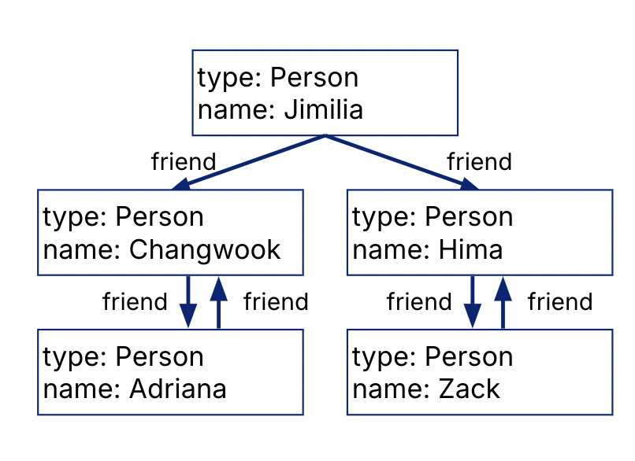

**Last Updated:** December 13th, 2024

# Property Graphs
**Nodes**
- variety of types of entities
- variety of properties per node

**Edges**
- must be **directed** edges
- variety of types of relationships
- variety of properties per edge



At the high level, just “two representations”: nodes and edges.
- As opposed to a more restricted, multi-relational schema. In property graphs, node encompasses many entity types, edge encompasses many relation types.
- Can be represented as just two relations in RDBMS
- Easy support of **graph expansion/evolution**: Add new nodes, new edges, properties to existing nodes/edges

Easily supports **graph traversal and path queries**:
- PathStart from any node, **efficiently find incoming/outgoing edges**, etc.
- As opposed to pure JSON, where nested structure is difficult to query/manage
- Flexible ordering/relationships creates more execution strategies

## Property Graphs in RDBMSes
```
CREATE TABLE nodes
(node_id INTEGER PRIMARY KEY,
 type STRING,
 properties JSON);

CREATE TABLE edges 
(edge_id INTEGER
   PRIMARY KEY, 
 head_id INTEGER
   REFERENCES Nodes(node_id), 
 tail_id INTEGER
   REFERENCES Nodes(node_id), 
 type STRING,
 properties JSON);
```


## Path Traversal Queries in SQL
Suppose we want to find **all the US locations** in the graph database.
- `nodes(node_id, type, properties)`
- `edges(edge_id, head_id, tail_id, type, properties)`

```
WITH RECURSIVE in_usa (node_id) AS (
  ( SELECT node_id
    FROM nodes
    WHERE properties->>'name' = 'United States'
  ) UNION (
    SELECT tail_id
    FROM edges
    JOIN in_usa ON edges.head_id = in_usa.node_id
    WHERE edges.type = 'within'
  )
)
SELECT * FROM in_usa;
```
> Path traversals of graphs in SQL are achieved using recursive CTEs.

If we wanted rapid path traversal on **incoming/outgoing** edges, we could build additional indexes:

```
CREATE INDEX edge_tails 
  ON edges(tail_id); 
CREATE INDEX edge_heads 
  ON edges(head_id);
```