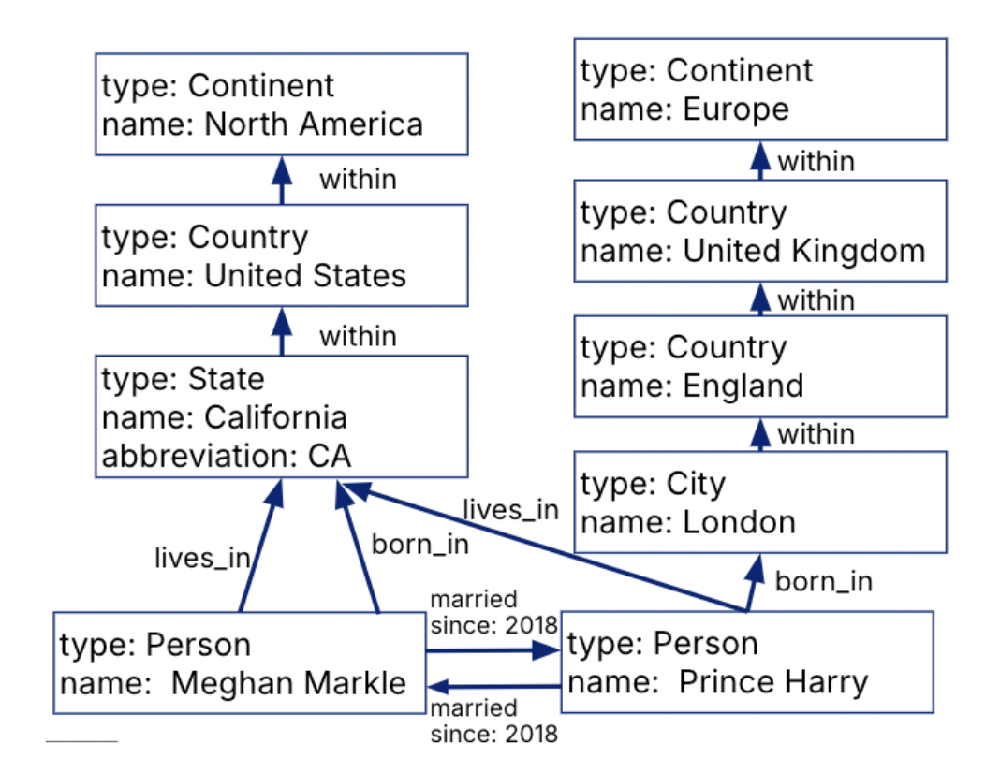

**Last Updated:** December 13th, 2024

# Triplestores/RDFs
Triplestores are database systems built for **semantic queries**.

- All data entities are represented as triples: (subject, predicate, object)
- Triplestores can represent property graphs

**RDF**s (Resource Description Format)
- Format for encoding and importing/exporting triples.
- Compatible with XML.
- **SPARQL**: Query language that operates on RDFs.
```
(Meghan, type, Person)
(Meghan, name, Meghan Markle)
(Meghan, born_in, CA)
(Meghan, lives_in, California)
(CA, type, State) 
(CA, name, California)
…
```


