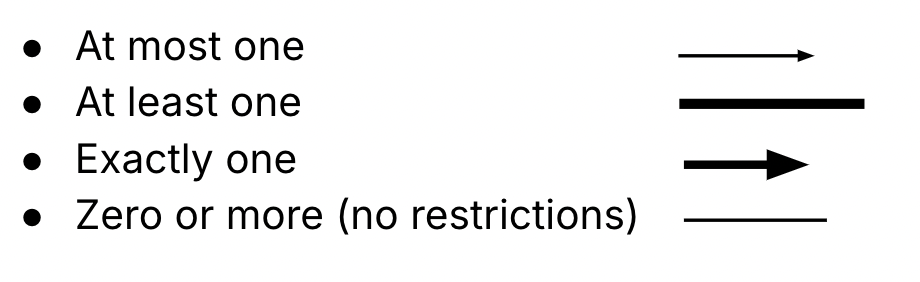
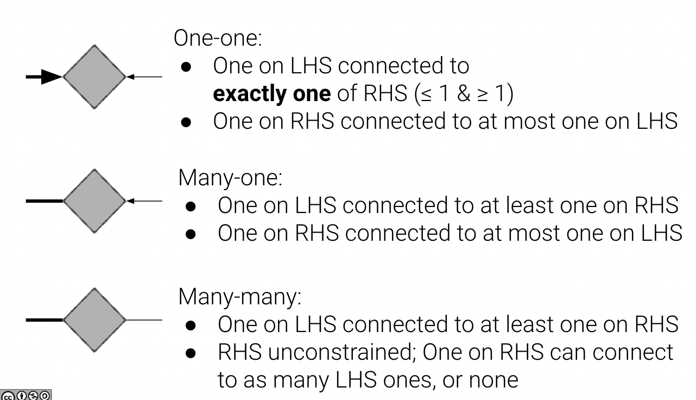
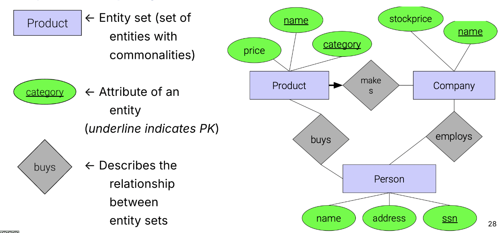
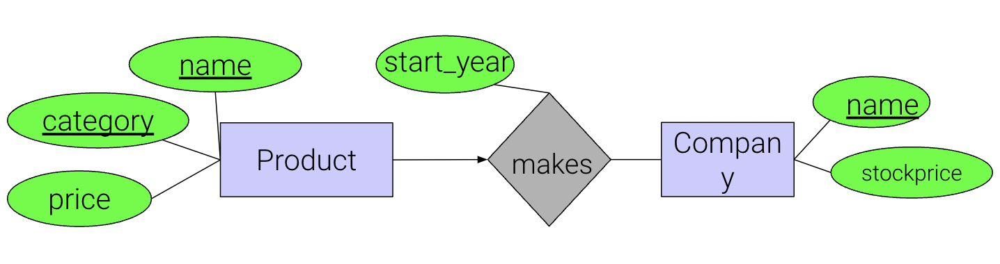
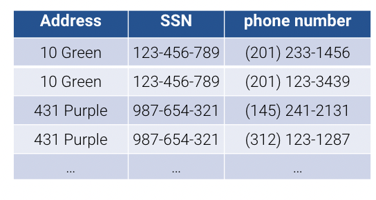
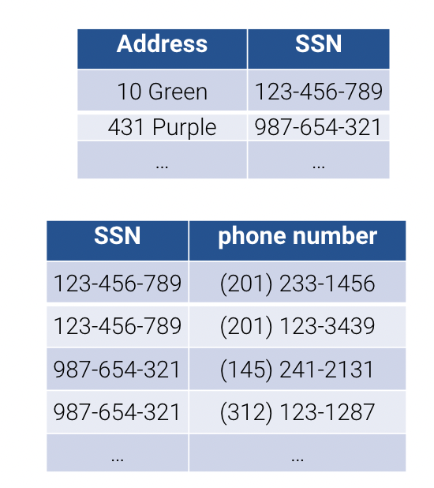

# Entity Relationship(ER) Diagrams

**Last updated**: October 28, 2024

Earlier in the course, we discussed SQL, relational algebra, and query performance, then we moved into data preparation, ranging from topics like structural transformations to entity resolution. Now, we'll begin discussing designing your database—thinking about how the relation itself is built with respect to another relation.

## ER Diagram
### Building Blocks of the ER Diagram
We will use the term **relational schema** to refer to the overall structure and interdependency for a set of relations.

The ER diagram represents entities and relationships.
- **Entities** are specific instances of things, objects, etc. **Entity sets** are sets of entities with common properties and are represented by rectangles in the ER diagram.
- **Attributes** are atomic features that describe entity sets or relationships. We use ovals to represent them and draw them connected to what they describe.
- **Relationships** connect entity sets together and usually take the form of a verb. We use diamonds to depict them.

### ER Relationships
Now that we have our entity set representations, we need to illustrate how they are connected to one another. 
We represent how entity sets are related to one another through the use of edges, as described below.

- **Undirected Edge** (no arrow) indicates **no constraints**
- **Directed Edge** (with arrow) constrains or determines the relation to be **at most one**
-  **Bolded Edge** determines the relation to be **at least one**
- **Bolded Directed Edge** determines the relation to be **exactly one**

With these different edges on both sides of our Relationship diamond, we can represent types of relationships, denoting how many entities can be connected or mapped across entity sets.

- **One-one**: One on LHS connected to at most one of RHS, and vice-versa
- **Many-one**: One on LHS connected to many on the RHS
- **Many-many**: No constraints. One on LHS connected to many/few on the RHS, and vice versa

With the introduction of a bolded edge, we can add further constraints to our existing relationships.

### Primary Keys in the ER Diagram
Recall that a primary key is a set of attributes that uniquely identify each item in the data. This is a form of a constraint—the key must be **unique** and **non-null** across the relation. We depict primary keys by underlining them. Note, every entity set is required to have a primary key.

### Design the ER Diagram

Above, we have just discussed the key components in the ER diagram. What we've been doing so far in creating the ER diagram is only one step in the process of creating the relational schema. We will now look at the three-step design process.

1. Start with data requirements.
2. Design the ER Diagram.
3. Translate to fit the relational model, i.e., convert the ER Diagram into a relational schema.

When designing the ER Diagram, it's important to keep these three principles in mind:
- Be faithful to reality.
- Pick the right kind of element.
- Avoid redundancy.

### Translate to Relational Schema
How do we build relations out of our created ER diagrams? Every entity set can created as a table/relation, and we can also create a table/relation for each relationship. However, in the case of many-one or one-one relationships, it may make sense to combine representations, since all columns are foreign keys or attributes of the relation. 

For example, we can take this relational schema:

- product(price, <u>name</u>, <u>category</u>)

- makes(product.name, category, start_year, company.name)

- company(<u>name</u>, stock_price)

and combine it to become this:

- product(name, category, start_year, company_name)

- company(name, stock_price)

All of the same information is retained but we are able to save space in
this manner. The only new information that comes from `makes` is
`start_year` which has been combined into `product` as `start_year`.

## Normalization

Normalization is the process of splitting them up again to minimize redundancy. Why would we decompose an ER diagram again? There may be situations where this just doesn't work according to the rules we've been following. 

 
Take the example of a relation storing address, SSN (Social Security Number), and phone number of individuals. A person, identified by their SSN could two phone numbers, and so they show up as two separate records in a relation. This is a redundancy because the address will be listed twice for both records with different phone numbers. This is subject to update anomalies where if that individual changes address, we have to go through the entire relation and change each of their addresses every time they show up. Similarly, we have deletion anomalies. If we delete the phone number for a person, we run the risk of losing that person in the database. We might need to check that another phone number exists for the individual. Otherwise, we lose address information (what is called a dangling pointer). 

In summary, each record seemingly refers to an entity set with consistent entities. But there is no "verb" that defines relationships for us to split this relation. 

### A Normalized Design
What could be a better way to design this? We could have a design where each bit of information only exists **once**. We are now splitting up the records to allow for reduced redundancy. We define **normalization** as the process of splitting (decomposing) relations into multiple relations to minimize redundancy. In contrast, **denormalization** is when you have redundant information because you have grouped information together. We rely on functional dependencies to guide normalization.

While normalization removes redundancy and minimizes updates/delete anomalies, if we want to group the data back together, it requires costly joins that we want to avoid.

## Functional Dependencies
How do we perform normalization? We use functional dependencies to split up the relations. As a guiding rule: if two tuples agree on values of the LHS, they must agree on the values of the RHS. This must hold for all instances. In other words, an input must uniquely determine an output, or a value on the LHS must have a unique mapping on the RHS, and vice-versa.