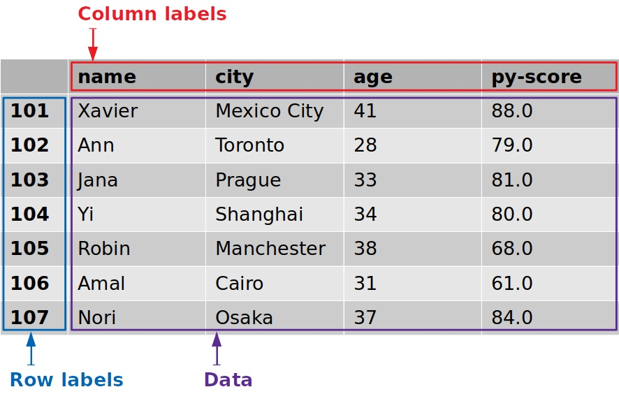

(data-models)=
# Data Models

**Last Updated**: October 13, 2024

We will look at the three data models we commonly see in data systems. We see matrices used in linear algebra and relations used in relational algebra. Dataframes are another common way to represent data.

## Tensors & Matrices

Matrices are defined to be an array of values that may be dense or sparse. Sparse matrices are matrices with many `NaN` (Not a Number) values, which is a value we use when we want to allow a value to be "missing" in the matrix. On the other hand, dense matrices are matrices with very few NaN values, if any.

Common operators and arithmetic properties apply to matrices as they do with arithmetic expressions. Just as the laws of commutativity, associativity, additive and multiplicative identity, additive inverse, multiplicative inverse, and distribution apply to some arithmetic expression, the same laws hold when working with matrices. Matrices are also symmetric across dimensions, meaning that we can transpose rows and columns without losing information.

Tensors are a generalization of matrices, but also specify the coordinate system of the array, unlike matrices. This means that when the coordinate system of the tensor transforms, the tensor's entries also transform and will satisfy the new coordinate system.

To understand this dynamic property of tensors, take for example a coordinate system where we have $2 \times 2$ tensors. If a 3rd dimension (i.e., a transformation) had to be implemented, we could change our tensors to have a 3rd dimension and satisfy this transformation. However, if our system had used matrices instead of tensors, this transformation would not be possible.

Tensors have this dynamic property due to their rank definition; the tensor rank describes the "dimension" of the array of values the tensor holds. For instance, if we have a tensor with a single value, a scalar, the tensor will have rank = 0. A 1-D array of values will correspond to a tensor rank of 1, a 2-D array ($m \times n$ array) to tensor rank of 2, a 3-D array ($m \times n \times o$ array) to a tensor rank of 3, and so on.

Dense matrices and tensors are standard in scientific computing simulations and machine learning contexts.

## Relations

Relations are defined by a schema, which is an ordered list of attribute name and datatype pairs. These pairs define a tuple type. An instance of a relation is defined as a set of $m$ tuples, $R_n$, that satisfy the type constraints outlined by the relation's schema. Missing values in this set of tuples $R_n$ take on a `NULL` value. Relations are not symmetric as transposing rows and columns will not produce an equivalent relation to the original relation.

Keys, a list of names contained in the schema, can optionally be defined in relations; keys impose integrity constraints on the relation such that no two tuples match on a key. Defining keys enables us to reference specific, unique tuples. When keys are not defined for relations, relations can be further defined as multisets of tuples.

Relations can also be used to represent matrices. This translation can be done by explicitly denoting the row indices and column indices of values in the matrix into column attributes in the relation. For instance, if we have a $2\times 2$ matrix, we can have a relation representation of the matrix by having a column for row index, a column for column index, and a final column for the actual value stored in the matrix at the $i$th row and $j$th column.

Well what about in the other direction? Can we represent relations using matrices? We cannot always represent relations using matrices because relations are usually sparse and do not have natural fields with which we can embed transformation operations into that make sense.

Despite this, we can force relations into matrices. This is when columns are forced into numeric-type columns, which is known as a process called featurization. During featurization, data may or may not stay faithful to the input, or may lose information in the process due to coercion.

## Dataframes

Dataframes, our third data model, borrow a mix of characteristics from relations and matrices. Dataframes have named rows, named columns, and are ordered, but only columns have datatypes. Both columns (attributes) and rows (index) will have labels. In this class, we'll be referring to dataframes in the context of R and Pandas.

Dataframes have a type induction opererator $S(A_i)$ that takes in a column of values and infers a type, allowing us to define the output schema of a transpose operation. This induction operator enables dataframes to be symmetric.

However, dataframes are still mathematically inelegant. After transposing a given dataframe, each column is of type `object`, and we lose information on the datatype a cell once was. Moreover, if we attempt to take the transpose of this transposed dataframe, we are unable to get the original dataframe back due to the data loss on datatype.

Dataframes can be further described as tidy or messy. Tidy dataframes are formed when we have tidy data, which is when each variable or attribute in our data forms a column, each observation or recorded entry forms a row, and each type of observational unit forms a table. In other words, a tidy dataframe is a relation.

On the other hand, messy dataframes are useful when we want to transition data from one form to another; it is a useful way to handle messy or unclean input data during a transient stage in data processing and analysis.
