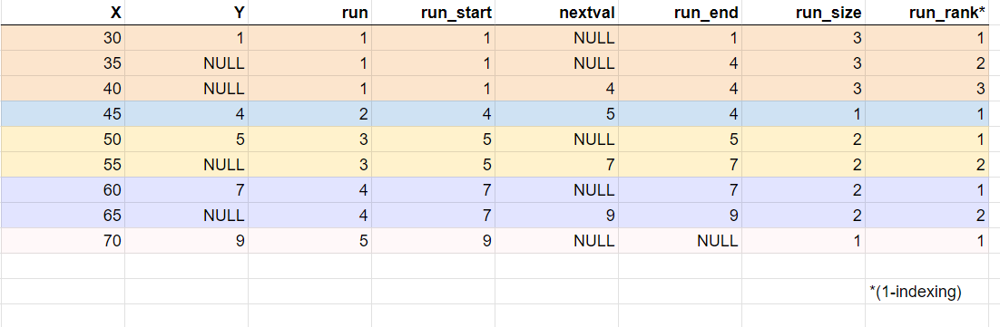

# Data Preparation  IV: Imputation and Entity Resolution

**Last Updated:** October 10th, 2024

## Data Preparation

We will be continuing our exploration of different data preparation methods and the different scenarios in which they are used. In this note, we will go over how to deal with cases of missing values and how to resolve cases of different records that refer to the same entity, primarily using techniques involving string functions.

### Imputation

Raw data will often include some missing or corrupted data, which we may want to fill in with replacements because downstream computations (such as machine learning pipelines) often depend on having all values for each entry.

In lecture, we looked at 4 different imputation methods:

1. Default values for a column: usually a column aggregate.
2. Correlation across columns: conditional distributions given other column data.
3. General model-based interpolation.
4. Interpolation across ordered rows.

Here is an example of methods 1 and 2. Consider a scenario where we are tracking the number of students attending each discussion section. A TA may have forgotten to record this number for one week's section, but we can use SQL to replace this value. Specifically, we can use `CASE` statements to introduce conditionals that can choose between passing through the existing value or using another expression to replace it.

We start by computing the averages for each TA:

```sql
WITH avg_attendance AS
SELECT id, AVG(num_students) AS avg
FROM discussion_metrics
GROUP BY id
```

Then, we can compute a version of the original table with null values replaced by the corresponding average:

```sql
SELECT attendance.id,
    CASE WHEN attendance.num_students IS NOT NULL
    THEN attendance.num_students
    ELSE a.avg END
FROM discussion_metrics AS attendance INNER JOIN avg_attendance AS a
ON attendance.id = a.id
```

But this may not be a good model for attendance, which (unfortunately) has a tendency to drop off over the semester. We can handle this by using linear regression to create a model of attendance over time.

First, we compute slopes and intercepts for each TA:

```sql
WITH avg_attendance AS
SELECT id,
    regr_slope(num_students, date) AS slope, 
    regr_intercept(num_students, date) AS intercept
FROM discussion_metrics
GROUP BY id
```

And then we can use this to replace NULLs:

```sql
SELECT attendance.id,
    CASE WHEN attendance.num_students IS NOT NULL
    THEN attendance.num_students
    ELSE (a.slope * attendance.date + a.intercept)::int END
FROM discussion_metrics AS attendance INNER JOIN avg_attendance AS a
ON attendance.id = a.id
```
This covers the basics of imputation, but there are even fancier techniques for better models, such as interpolating over chunks of NULL values in ordered rows.

### Linear Interpolation

Say we have a column that has consecutive rows of NULL values. We want to interpolate across runs of NULLs using scalar math. To do this, we first require some statistics to be added on to every row that is specific to the run that the record is in:

- **run**: Unique run number for each value + subsequent NULLs (i.e., the first run in the table has a **run** of 1).
- **run_start**: Initial non-NULL value in run.
- **run_end**: The next non-NULL value (this is also the initial value of the next run).
- **run_size**: Total number of rows in the run.
- **run_rank**: This row's index in the run.

We partition by **run** to section out our data into their respective runs and then use **run_start** as our starting value, **run_end** as our ending value, and **run_size** to figure out how to evenly interpolate the data among all the **run_rank**s for each run. For a more complete picture of how to perform linear interpolation (complete with forward, backward, and scalar passes), please see the lecture notebook for an example in SQL.



*Note that this example uses 1-based indexing.*

Let's start by taking a look at the first run (in light orange, rows 1-3). Our attribute of interest is Y. We see that we have 2 NULLs in rows 2 and 3. So we can identify this as part of a run. A run is either a single record with a known value (the blue row is a run by itself because it has a known Y value. We do not need to do any interpolation on this record) or a set of records with NULLs. For the latter, when we have a NULL, we need to include the row above it as part of our run so that we can use this value to then interpolate/impute the NULL value. This is why our run begins with the row above the null, in this case, row 1.

Now, we can identify our first run as rows 1-3 (highlighted in orange). Our **run_start** (see above for the definition) is 1 as the first Y value in our run. This value MUST be non-NULL (so that we are able to infer the other values from it).

To find **run_end**, we have to look outside of our run (because our run is currently 1, NULL, NULL). We need to find a value that we can consider to be the end of our interpolation. Think about it as trying to guess the missing values in `[5, f, g, 20]`. We need the start and end. We look to find the next non-NULL value in our table (this is the start of the next run). We look in run 2 (in blue, row 4) and find the next non-NULL value in Y to be 4 and use this as **run_end**. To find **run_size**, we count the number of records in our run and then we can index them to find **run_rank**.

Note: There is a special case where the value is known, in which case **run_end** is that value itself (see row 1). Another way to think about this is that the start and end must be the same to get the same known value `[start, end]` being `[1, 1]` and no interpolation is needed (or whatever interpolation you attempt to do, you will still get 1).


## Entity Resolution

Entity resolution is one of the many processes in canonicalizing data records. It is also known as data matching, deduplication, standardization, record linkage, etc. Our goal with entity resolution is to identify each distinct real-world entity and match up all the data that corresponds to the same entity.

Here is an imagined scenario of why we need entity resolution. After preparing our data so that it is ready to process, there is still one significant barrier to performing data analysis: joins. Although we have cleaned data locally, within each table, we have not cleaned up the connections between these tables, such as the strings we may want to join on.

For example, consider a dataset with two tables consisting of human-entered data: one with product names and their prices, and one with product names and their popularity. A natural analysis query may be to join these:

```sql
SELECT a.name, a.price, b.popularity
FROM prices AS a INNER JOIN popularity AS b
ON a.name = b.name
```
But because these tables have been entered by humans, there may be slight differences in the names used to identify equivalent products. For example, the prices table may have a row with the name "Off The Record (Single)", but the popularity table may instead use the name "Off The Record [Single]". Small differences like this will fail the equality condition in our join, resulting in many pairs missing from the query result.

### Matching Data

What can we do in such situations? Well, if we consider this example, what we want to do is perform a join with a richer predicate that compares the string but tolerates slight differences between them. One algorithm we can use to compute this "tolerance" is the **Levenshtein distance**.

At its core, the Levenshtein distance computes the fewest number of insertions (adding a character), deletions (removing a character), and mutations (replacing one character with another) required to transform one string to another. For example, in our example above, the Levenshtein distance is 2, because we replace the "(" with "[" and the ")" with "]".

With a function to compute the Levenshtein distance (which is available in many databases), we can rewrite this query to tolerate slight differences:

```sql
SELECT a.name, a.price, b.popularity
FROM prices AS a, popularity AS b
WHERE levenshtein(a.name, b.name) < 5
```

Note that because we are performing an advanced calculation on every pair of tuples from the input tables, we cannot optimize this query using strategies such as a hash join. Instead, this query will perform a nested iteration over both tables and compute the distance for each pair, which will be _extremely slow_ as this is a full cross join. Thankfully, there are smarter indexing strategies that can optimize this, which we will learn about later in this course.

### Blocking and Matching

In some situations, we may not be performing a specific join but want to identify chunks of our data that correspond to equivalent real-world entities. We break this down into two phases: **blocking** to identify subsets of the data that contain values that are likely to be equivalent and **matching** to determine exactly which values correspond to the same entity.

Blocking is typically performed with a regular `GROUP BY`, with some key that is used as an approximation for equivalence (note that we may generate several keys for one row, because blocks may overlap). For example, we can use **_q_-gram** blocking, where we create blocks for every substring of length _q_ that show up in the source data. We can span multiple fields, with the help of a delimiter, e.g., `$`.

As an example, here are the tri-grams (3-grams) of the two-field tuple `('picasso', 'pablo')`:

```text
{'pic', 'ica', 'cas', 'ass', 'sso', 'so$', 'o$p', '$pa', 'pab', 'abl', 'blo', 'lo$'}
```

With _q_-gram blocking, we make one block _per_ distinct _q_-gram. When choosing _q_, we face different tradeoffs. If _q_ is too small, we have **low precision** as more entities are in most blocks. On the other hand, if _q_ is too big, we have **low recall**, where entities that should be together are _not_.

Once our blocks are formed, the next step is to cluster our entities into equivalence classes. First, we define a metric to numerically compute a "distance" between values, which can be either:

- **Univariate** (between pairs of values): string distance, abbreviations, synonyms, knowledge-based hierarchies.
- **Multivariate** (between pairs of tuples).

Then, we can employ a clustering algorithm to merge values that are close to each other. These results can then be used in a data analysis to traverse the graph of identical and related values.

One approach is **correlation clustering**, where we either want to minimize the sum of intra-cluster (within) edge weights (very tight compact clusters) or maximize the sum of inter-cluster (between) edge weights (clusters far away from other clusters). Ultimately, we heuristically threshold clusters, in which we determine if two nodes are close enough, they are declared the "same entity," or if two nodes are far enough, we prune the edge and declare them "different entities."

Entity resolution is often very important, but in practice can be a tricky process as we rely on heuristics upon heuristics and have a limited human ability to assess results. However, ER can be reliable in specific domains, such as mature domains, domains with lots of training data, and domains where human review is practical.


