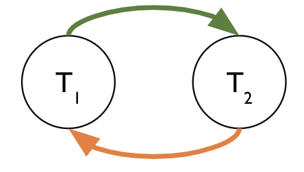

# Transactions

**Last Updated:** December 4th, 2024

## Transactions
In most situations, many users can query \& update a database simultaneously, causing concurrency issues. One user can write to the database while another user reads from the same resource, or both users may try to write to the same resource. We use transactions to address these problems. A transaction is a sequence of multiple actions to be executed as a single, logical, atomic unit. From SQL view, a transaction is in the form of: 
- Begin transaction 
- equence of SQL statements
- End transaction

### ACID
Transactions guarantee the ACID properties to avoid the concurrency problems discussed above: 

- **Atomicity**: “All or nothing” nature of a transaction. Either all operations of a transaction are executed or none are.
- **Consistency**: If COMMIT succeeds, all the database integrity checks hold true. (primary key/foreign keys, constraints, etc.)
- **Isolation**: Concurrent transactions should externally appear to run sequentially, i.e., 2 concurrent transactions should not “see” each other’s intermediate results.
- **Durability**: Ensures that once a transaction is committed, its effects are permanent in the database, even in the case of system failures.

## Serialization
### Serial Schedules
- Transaction schedule: a sequence of reads and writes by named transactions on named objects.
- Serial Schedules: transactions that run from start to commit without interleaved actions from any other.
- Serializable Schedules: a schedule that has results equivalent to a serial schedule.

### Conflict Dependency Graph 
How do we know if a schedule is serializable?
We define a notion of conflicting actions, and two actions conflict if:
- They are from two different, concurrent transactions
- They reference the same object
- At least one is a Write 

One way to check if a schedule is serializable is to build a conflict graph. Conflict graphs have the following structure:
- One node per transaction

- An edge exists from `Tᵢ` to `Tⱼ` if:

  -  An operation `Oᵢ` of `Tᵢ` conflicts with an operation `Oⱼ` of `Tⱼ`.

  -  `Oᵢ` appears earlier in the schedule than `Oⱼ`.

A **cycle** corresponds to a schedule that is not **conflict serializable**. A schedule is conflict serializable if and only if its dependency graph is **acyclic**. Every conflict serializable schedule is serializable. An example of a schedule that is not conflict serializable is shown below. 

