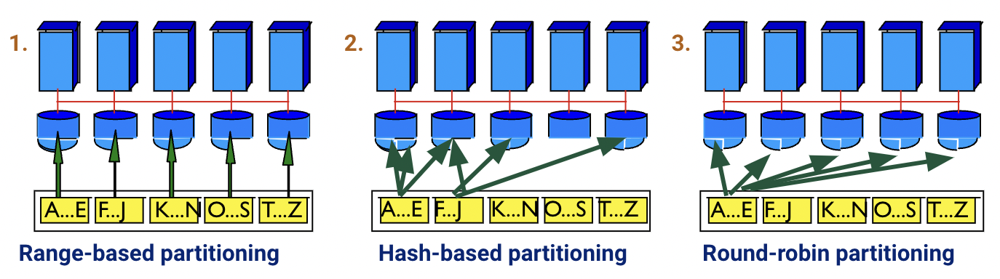
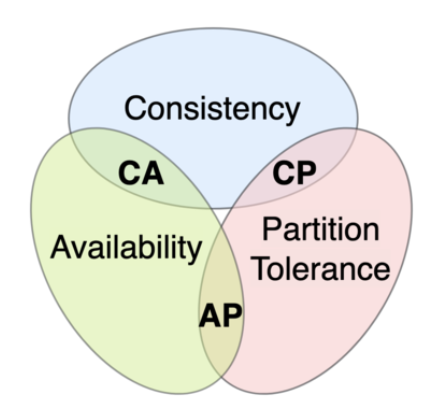
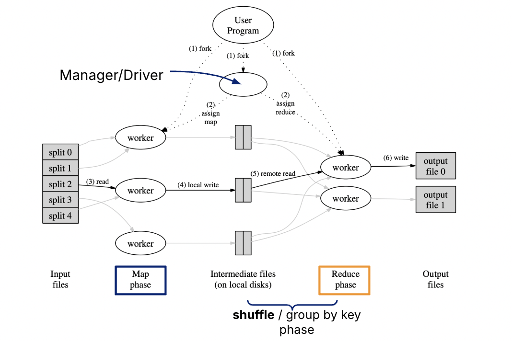
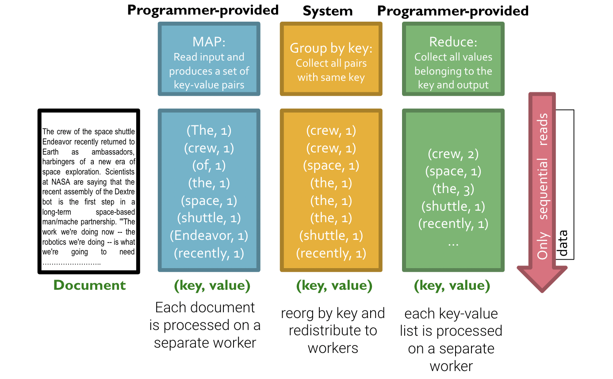

**Last Updated:** December 13th, 2024

## Parallel and Distributed Computing

### Parallel Computation Architecture
Three different paradigms of these computing resources are:
- Shared Memory: Multiple cores accessing shared memory and disk.
- Shared Nothing: Multiple commodity nodes each with their own memory and disk. A manager node will coordinate with worker nodes, with each worker responsible for a piece of the data. In a sense, each of the worker nodes will work on their own data on their own machine, do their task, and then hand it back to the manager. 
- Shared Disk: Worker nodes have their own memory and may have a local disk as a cache. Each may be responsible for a piece of data from a shared disk.

### Partitioning Strategies

We partition the data, and place each piece in different disks, assuming
that all those disks may be accessed by different worker nodes or
computers. How we separate/partition our data depends on the data model
itself:

1.  Vertical partitioning: By columns (features)

2.  Horizontal partitioning: By records (documents, rows, etc.). More
    generalizable, works for both relations/column stores and document
    stores.

There are three horizontal partitioning approaches depending on the data
skew. Skew is a common problem when dealing with parallel processing
across many machines, due to uneven data distribution or uneven access
patterns.



1.  Range-based partitioning: Pick processor $j$ for tuple $i$ if its
    value for some field is within range $i$. Fairly susceptible to
    skew if there are some partitioning attribute ranges that are very popular (from either standpoint: data or access).


2.  Hash-based partitioning: Pick a field. Pick a processor for a tuple by hashing this field. Somewhat susceptible to skew if there are specific attribute values that are very popular (i.e., "heavy hitters" or duplicates), though it generally handles range skew better than range-based partitioning.


3.  Round-robin partitioning: Hash tuple $i$ to processor $i\%n$. Not
    susceptible to skew since work is equally divided, but there is more
    work involved since all partitions need to be consulted.

### Partitioned Operators and Pipelining

Now that we have partitioned the data across multiple computers or
nodes, how do we actually access information from them? The work happens
in a 2-tier system, consisting of the manager and the workers, which
we've been broadly referencing. The manager is responsible for
delegating tasks to worker nodes, and workers all perform the tasks in
parallel. Different partitioning methods (e.g., range, hash,
round-robin) all affect the delegation process. Like serial DBMS
operations, operators can be pipelined to achieve faster processing.

Standard relational operators like selection, projection, and joins can
be adapted for parallel processing in a distributed environment. Similar
delegation occurs for update and insert operations. The manager assigns
these tasks to the relevant worker nodes based on data partitioning.

## CAP Theorem 
Any distributed data store can deliver at most two of the three properties.

**Consistency**:
All clients see the same data at the same time, no matter which node they connect to.  Data is either instantly accessible on all partitions, or a write is not confirmed until copies are made to all partitions (Consistency here is different from the consistency defined in the ACID transaction properties).

**Availability**:
Any client making a request for data gets a response, even if one or more nodes are down. All working nodes in the distributed system return a valid response for any request, without exception.

**Partition-Tolerance**:
A communications break within a distributed system—a lost connection between two nodes. Partition tolerance means that the cluster must continue to work despite any number of communication breakdowns between nodes in the system.

### "Pick Two" - Trade-Offs!


**CP**: consistency and partition tolerance. When a partition occurs between any two nodes, the system has to shut down the non-consistent node (i.e., make it unavailable) until the partition is resolved.

**AP**: availability and partition tolerance. When a partition occurs, all nodes remain available but those at the wrong end of a partition might return an older version of data than others. (e.g. stale reads)

**CA**: consistency and availability. 
❌ This is impossible in a network with partitions.
This is practically impossible in a distributed network. Network and hardware failures mean a partition can occur at any time; therefore, a distributed system must generally choose between CP and AP.


## MapReduce
MapReduce is a programing framework introduced in 2004 at Google to handle parallel/distributed computing!



### Workflow
1. **Input Files:** Data is divided into chunks, where each chunk represents a portion of the dataset.
2. **Map Phase:** Each worker/machine processes its assigned chunk and applies the user-defined map function to produce intermediate key-value pairs.
3. **Shuffle/Group by Key Phase:** Intermediate files generated during the Map phase are redistributed and grouped by keys to prepare for aggregation.
4. **Reduce Phase:** Reduce workers take the grouped data and apply the user-defined reduce function to aggregate the results.
5. **Output Files:** The final results are written to output files.

### Map and Reduce functions

- **`Map(k, v) → <k', v'>*`**
  - Takes a key-value pair and outputs a set of key-value pairs.
  - There is one `Map` call for every `(k, v)` pair.

- **`Reduce(k', <v'>*) → <k', v''>*`**
  - All values `v'` with the same `k'` are reduced together and processed in `v'` order.
  - There is one `Reduce` function call per unique key `k'`.

In words, `Map` runs item-by-item processing by reading in a large amount of data and then extracting a value from it. `Reduce` collects items corresponding to the same key and processes those items together.

In SQL, the programmer writes the SELECT-FROM-WHERE query, and manager nodes optimize the query and instruct worker nodes on how to execute it efficiently. In the MapReduce paradigm, the engineer explicitly decides what the worker nodes should do during the **Map** process. The worker nodes then return the output, which is reduced into a specified form during the **Reduce** process.

---

### Example: Counting Word Frequencies
Suppose a crawl of the entire World Wide Web is stored across `N` machines, and we want to count the number of times each word appears.



In the parallel model:
- We give a batch of documents to each machine and tell each machine to count the occurrences of each word in **its** small batch of documents and return the results to another machine.

In the MapReduce model:
1. **Map Function**: Each worker machine counts the occurrences of each word in its batch of documents.
2. **Shuffle Stage**: The intermediate results are grouped and sorted by key (the word) to prepare for efficient aggregation.
3. **Reduce Function**: The manager machine sums up all the counts it received for each word.

The process is split into the following stages:
- `Map`: Tells each worker machine to count the words in its documents.
- `Shuffle`: Groups/sorts pairs based on the word to efficiently group by keys.
- `Reduce`: Tells the manager machine to sum up the counts for each word.

#### Python Pseudo-code
```python
# Map Function: Processes one document
# Input: (doc_id, text_content)
def map(doc_id, text):
    for word in text.split():
        emit(word, 1)

# Reduce Function: Processes all counts for a specific word
# Input: (word, list_of_counts) e.g., ("apple", [1, 1, 1, ...])
def reduce(word, counts):
    total_count = sum(counts)
    emit(word, total_count)
```